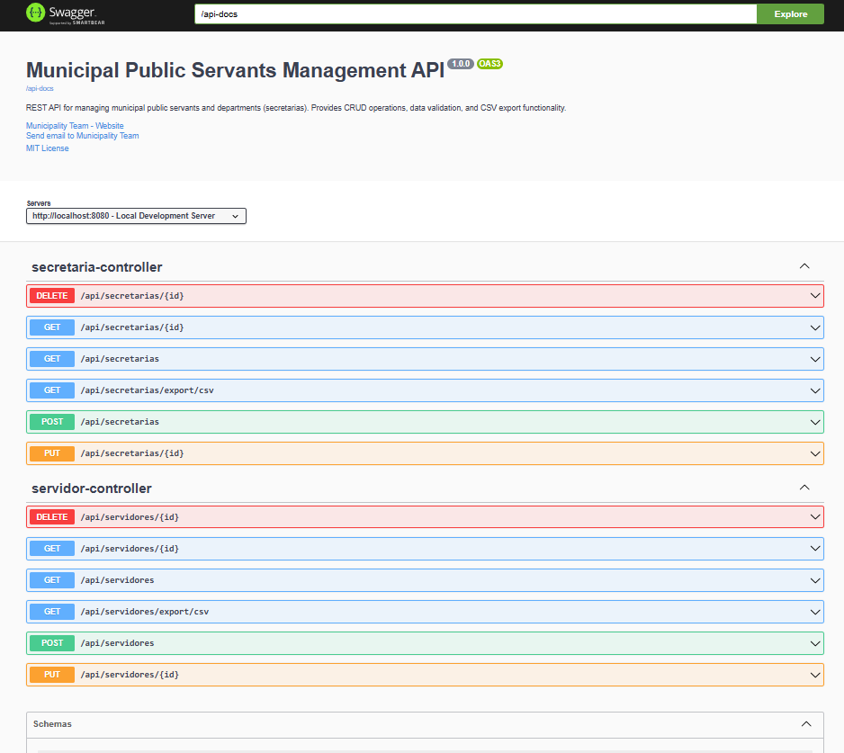
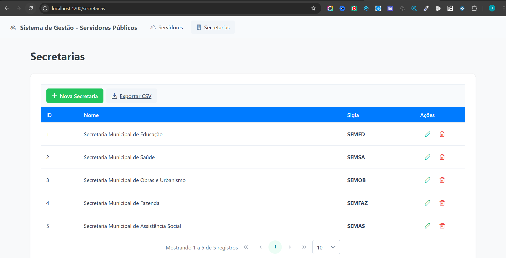
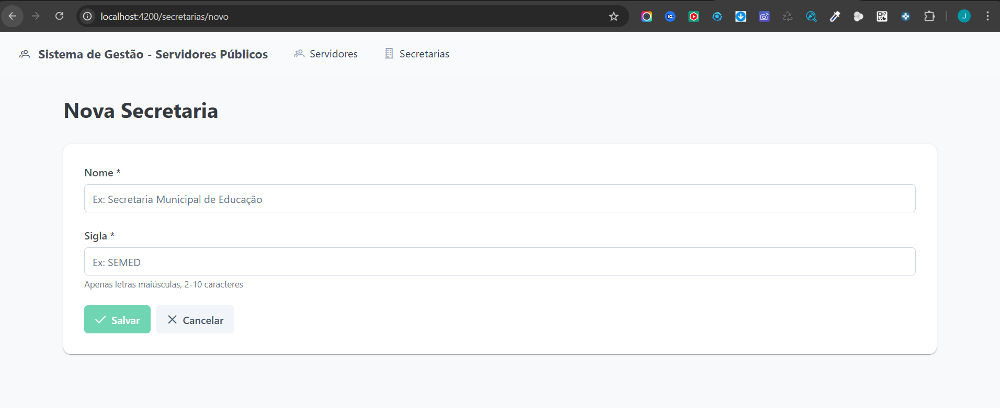
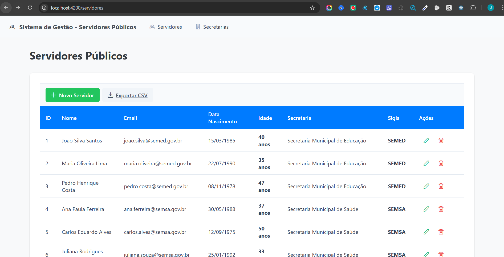
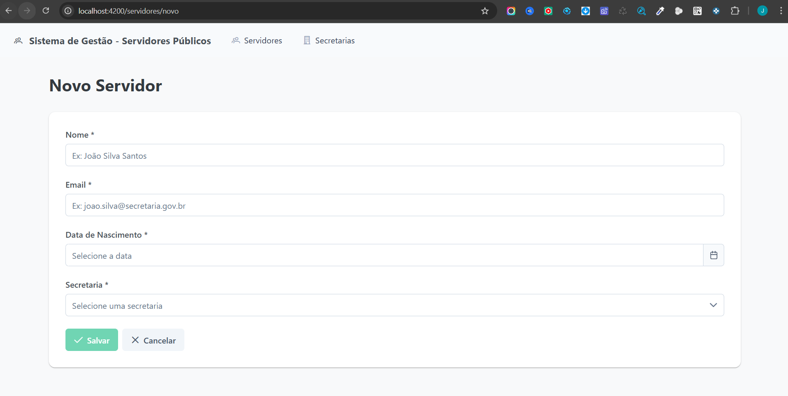

# Sistema de Gestão de Servidores Públicos Municipais

Sistema fullstack desenvolvido para gerenciamento de servidores públicos municipais e suas respectivas secretarias.

## 📋 Descrição do Projeto

Aplicação CRUD completa que permite:
- ✅ Gerenciar **Secretarias** (nome e sigla)
- ✅ Gerenciar **Servidores** (nome, email, data de nascimento e secretaria vinculada)
- ✅ Validação de idade automática (18 a 75 anos)
- ✅ Exportação de dados para CSV
- ✅ Interface moderna com UX aprimorada

## 🛠️ Tecnologias

### Backend
- **Java 17**
- **Spring Boot 2.7.18**
- **Spring Data JPA**
- **H2 Database** (em memória)
- **MapStruct 1.5.5**
- **Lombok**
- **Maven**

### Frontend
- **Angular 19**
- **PrimeNG 19.0** (Componentes UI)
- **RxJS 7.8**
- **TypeScript 5.5**

## 🏗️ Arquitetura

### Backend
```
backend/
├── src/main/java/com/municipality/servants/
│   ├── config/              # Configurações (CORS)
│   ├── core/                # Exceções e validações
│   ├── features/
│   │   ├── secretaria/      # Feature module Secretaria
│   │   │   ├── controller/
│   │   │   ├── service/
│   │   │   ├── repository/
│   │   │   ├── entity/
│   │   │   ├── dto/
│   │   │   └── mapper/
│   │   └── servidor/        # Feature module Servidor
│   │       └── ...
│   └── ServantsManagementApplication.java
└── src/main/resources/
    ├── application.yml
    └── data.sql             # Dados de teste
```

**Padrão**: Controller → Service → Repository (3 camadas)

### Frontend
```
frontend/
├── src/app/
│   ├── core/                # Services, Interceptors, Models
│   ├── features/
│   │   ├── secretaria/      # Componentes de Secretaria
│   │   └── servidor/        # Componentes de Servidor
│   ├── shared/              # Validadores reutilizáveis
│   ├── app.component.ts
│   ├── app.config.ts
│   └── app.routes.ts
└── src/environments/
    └── environment.ts       # URL da API
```

**Padrão**: Feature-based modules com standalone components

## 🚀 Como Executar

### Pré-requisitos
- **Java 17+**
- **Maven 3.6+**
- **Node.js 20+**
- **npm 10+**

### 1. Backend

```bash
cd backend
mvnw clean install
mvnw spring-boot:run
```

**Endpoints disponíveis:**
- API: http://localhost:8080
- H2 Console: http://localhost:8080/h2-console
  - JDBC URL: `jdbc:h2:mem:servants_db`
  - Username: `sa`
  - Password: (vazio)

### 2. Frontend

```bash
cd frontend
npm install
npm start
```

**Aplicação disponível:**
- http://localhost:4200

## 📡 API Endpoints

### Secretarias
| Método | Endpoint | Descrição |
|--------|----------|-----------|
| GET | `/api/secretarias` | Lista todas |
| GET | `/api/secretarias/{id}` | Busca por ID |
| POST | `/api/secretarias` | Cria nova |
| PUT | `/api/secretarias/{id}` | Atualiza |
| DELETE | `/api/secretarias/{id}` | Exclui |
| GET | `/api/secretarias/export/csv` | Exporta CSV |

### Servidores
| Método | Endpoint | Descrição |
|--------|----------|-----------|
| GET | `/api/servidores` | Lista todos |
| GET | `/api/servidores/{id}` | Busca por ID |
| POST | `/api/servidores` | Cria novo |
| PUT | `/api/servidores/{id}` | Atualiza |
| DELETE | `/api/servidores/{id}` | Exclui |
| GET | `/api/servidores/export/csv` | Exporta CSV |

## ✅ Funcionalidades Implementadas

### Requisitos Funcionais
- ✅ CRUD completo de Secretarias
- ✅ CRUD completo de Servidores
- ✅ Validação de email
- ✅ Validação de nome obrigatório
- ✅ Validação de secretaria obrigatória
- ✅ Validação de data de nascimento (18 a 75 anos)
- ✅ Persistência em banco de dados
- ✅ CORS habilitado

###  Implementados
- ✅ **Exportação CSV/XLS**: Backend gera CSV, frontend tem botão de download
- ✅ **Framework UI**: PrimeNG com componentes profissionais
- ✅ **UX Aprimorada**:
  - Loading spinners automáticos
  - Toasts de feedback (sucesso/erro)
  - Confirmação de exclusão
  - Validação visual de formulários
  - Mensagens de erro amigáveis
  - Cálculo de idade em tempo real

### Validações

**Backend:**
- Validação com JSR-380 Bean Validation
- Validador customizado de idade (`@ValidAge`)
- Validação de negócio (email único, sigla única)
- Tratamento global de exceções

**Frontend:**
- Validators do Angular
- Validador customizado de idade (calculado)
- Validação visual inline
- Mensagens de erro por campo

## 📊 Dados de Teste

O sistema inicia com dados pré-cadastrados:
- **5 Secretarias**: SEMED, SEMSA, SEMOB, SEMFAZ, SEMAS
- **15 Servidores**: Distribuídos entre as secretarias

## 🎨 Interface do Usuário

### Telas Implementadas
1. **Lista de Servidores** (página inicial)
   - Tabela paginada com 10 registros por página
   - Botões de ação (Editar, Excluir)
   - Botão "Novo Servidor"
   - Botão "Exportar CSV"

2. **Formulário de Servidor**
   - Campos: Nome, Email, Data de Nascimento, Secretaria
   - Dropdown para selecionar secretaria
   - Calendário para data de nascimento
   - Cálculo de idade em tempo real
   - Validação completa

3. **Lista de Secretarias**
   - Tabela paginada
   - Botões de ação
   - Exportação CSV

4. **Formulário de Secretaria**
   - Campos: Nome, Sigla
   - Validação de sigla (letras maiúsculas)

## 🔒 Segurança

### Backend
- CORS configurado para `http://localhost:4200`
- Validação em múltiplas camadas (DTO → Service → Database)
- Tratamento de exceções centralizado
- SQL Injection prevenido (Spring Data JPA)

## 📦 Build para Produção

### Backend
```bash
cd backend
mvnw clean package
java -jar target/servants-management-1.0.0.jar
```

### Frontend
```bash
cd frontend
npm run build
# Arquivos gerados em: dist/servants-management-frontend/
```

## 🌐 Deploy

### Sugestões de Plataformas

**Backend:**
- Heroku
- Railway
- AWS Elastic Beanstalk
- Google Cloud Run

**Frontend:**
- Netlify
- Vercel
- Firebase Hosting
- AWS S3 + CloudFront

## 📝 Documentação Adicional

- [Backend README](./backend/README.md) - Documentação detalhada do backend
- [Frontend README](./frontend/README.md) - Documentação detalhada do frontend

## 🎯 Diferenciais Técnicos

### Backend
- ✅ Arquitetura em camadas bem definida
- ✅ MapStruct para mapeamento DTO ↔ Entity
- ✅ Lombok para redução de boilerplate
- ✅ Validação customizada de idade
- ✅ Tratamento global de exceções
- ✅ Logs estruturados
- ✅ Auditoria automática (createdAt, updatedAt)

### Frontend
- ✅ Standalone components (Angular 19)
- ✅ Interceptors para erro e loading
- ✅ Services reutilizáveis
- ✅ Validação customizada de idade
- ✅ Cálculo de idade em tempo real
- ✅ UX profissional com PrimeNG

# Telas (imagens do sistema)







## 📄 Licença

Projeto desenvolvido para desafio técnico Fullstack - Spring + Angular (Pleno/Sênior).

---

**Desenvolvido com** ❤️ **usando Spring Boot e Angular**
